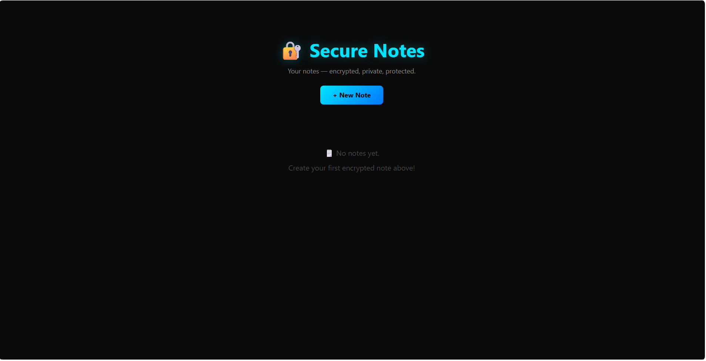
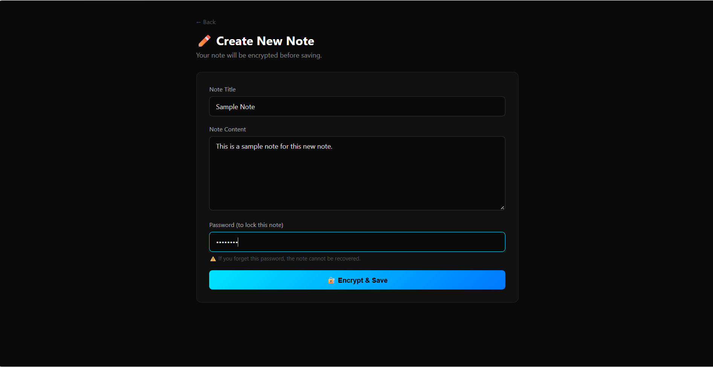
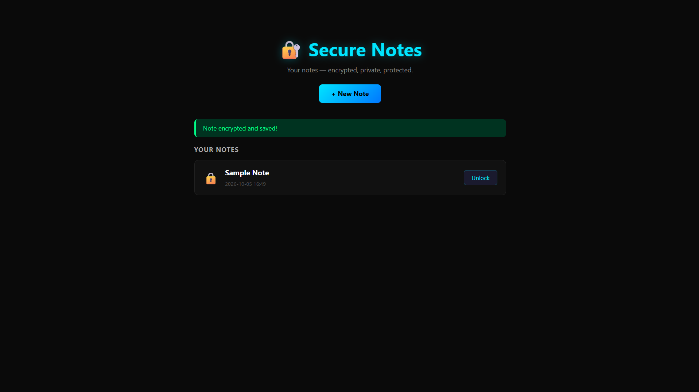
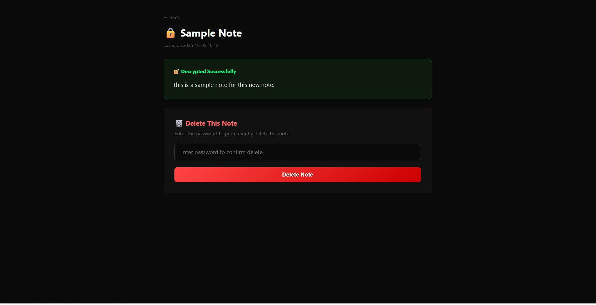

# 🔐 Secure Notes App

A web application that lets users create, store, and retrieve private notes protected by **real encryption**. Built with Python and Flask as part of a cyber security portfolio.

---

## 📸 Screenshots

### Home Page


### Create a Note
!

### Unlock a Note


---

## 🛡️ How the Security Works

- Notes are encrypted using **Fernet symmetric encryption** from Python's `cryptography` library
- The encryption key is **derived from your password** using **PBKDF2 with SHA-256** (100,000 iterations)
- A unique **random salt** is generated for every note — meaning two notes with the same password still encrypt differently
- The raw note content is **never stored in plain text** — only unreadable encrypted bytes are saved
- If you enter the wrong password, the note **cannot be decrypted** — there is no backdoor

---

## ✨ Features

- ✅ Create encrypted notes with a title, content, and password
- ✅ View notes by entering the correct password
- ✅ Wrong password = note stays locked
- ✅ Delete notes (password required to confirm)
- ✅ Dark themed UI
- ✅ SQLite database for local storage

---

## 🚀 How to Run Locally

**1. Clone the repository**
```
git clone https://github.com/Kevin03-cyber/secure-notes.git
cd secure-notes
```

**2. Create and activate a virtual environment**
```
python -m venv venv
venv\Scripts\activate
```

**3. Install dependencies**
```
pip install flask cryptography
```

**4. Run the app**
```
python app.py
```

**5. Open your browser and go to:**
```
http://127.0.0.1:5002
```

---

## 🗂️ Project Structure

```
secure-notes/
│
├── app.py              # Main Flask app with encryption logic
├── templates/
│   ├── index.html      # Home page — lists all notes
│   ├── create.html     # Create a new encrypted note
│   └── view.html       # Unlock and view a note
├── static/
│   └── style.css       # Dark theme styling
└── README.md
```

---

## 🔧 Technologies Used

| Technology | Purpose |
|---|---|
| Python + Flask | Web framework |
| Cryptography (Fernet) | Note encryption/decryption |
| PBKDF2 + SHA-256 | Key derivation from password |
| SQLite | Local database storage |
| HTML + CSS | Dark themed front end |

---

## ⚠️ Important Note

This app is built for **educational and portfolio purposes**. Notes are stored locally on your machine. Do not use this to store real sensitive information in a production environment.

---

